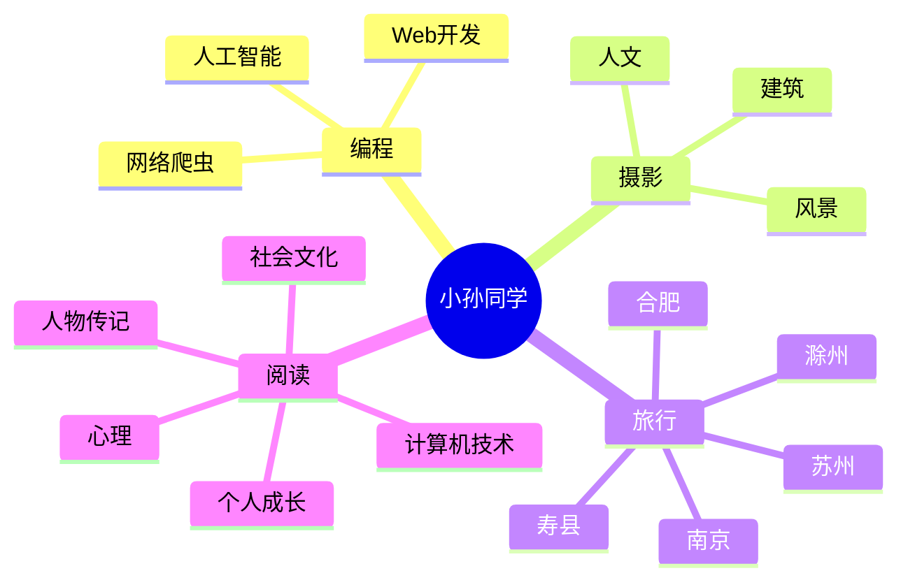

 
 

    
 

 <!-- profile logo 个人资料徽标 -->
  

    &emsp;
    &emsp;
    &emsp;
    &emsp;
    &emsp;
    &emsp;
    &emsp;
    <!-- visitor statistics logo 访客数统计徽标 -->
    
  

 <!-- Snake Code Contribution Map 贪吃蛇代码贡献图 -->
<picture>
  <source media="(prefers-color-scheme: dark)" srcset="https://cdn.jsdelivr.net/gh/sun0225SUN/sun0225SUN/profile-snake-contrib/github-contribution-grid-snake-dark.svg" />
  <source media="(prefers-color-scheme: light)" srcset="https://cdn.jsdelivr.net/gh/sun0225SUN/sun0225SUN/profile-snake-contrib/github-contribution-grid-snake.svg" />
  
</picture>

### 🙋About Me 
---
- 💭 前后端爱好者，热爱编程
- 🧑‍💻 [关于我](https://XLH1028.github.io) 一位程序员的的发展史
- 🏡 作品：[聚合AI](https://XLH1028.github.io)  ｜  [二手手机](https://XLH1028.github.io)   ｜   [仓库管理系统](https://XLH1028.github.io)  ｜ [模比特币系统](https://XLH1028.github.io)
- 🪴 公众号：匿未信封
- 🏂 学习视频：[kuangshen](https://www.kuangstudy.com/)
- 📚 个性签名：当机会来临的时候，我时刻准备着
- ⛹ 爱好：打篮球 ｜ 羽毛球 ｜ 跑步 ｜ 编程 ｜ ......
- ⛵ 在小的帆，也能远航
- 🛵 My   visitor
 

#  🙋 Hello

<table>
<tr><td>

</tr>

<tr><td>

### 🧠 Second Brain

<!-- START_SECTION:brain -->
* <a href='https://brain.sunguoqi.com/web/guide/history.html' target='_blank'>前端开发简史</a> - 2023-03-25
* <a href='https://brain.sunguoqi.com/web/guide/learn-road.html' target='_blank'>前端学习路线</a> - 2023-03-26
* <a href='https://brain.sunguoqi.com/dv/basic/data/31.html' target='_blank'>选择合适方法对数据进行处理</a> - 2023-07-27
* <a href='https://brain.sunguoqi.com/dv/basic/data/32.html' target='_blank'>可视化数据处理的一般方法</a> - 2023-07-27
* <a href='https://brain.sunguoqi.com/dv/basic/data/33.html' target='_blank'>如何处理多元变量</a> - 2023-07-27
<!-- END_SECTION:brain -->

</td></tr>

<tr><td>

### 🤾‍♂️ Funny Soul

<!-- START_SECTION:douban -->
* <a href='https://book.douban.com/subject/35193035/' target='_blank'>最近在读认知觉醒</a> 🌟🌟🌟🌟🌟 力荐- 2023-04-17
* <a href='http://movie.douban.com/subject/1292052/' target='_blank'>看过肖申克的救赎</a> 🌟🌟🌟🌟🌟 力荐- 2023-02-07
* <a href='http://movie.douban.com/subject/1292365/' target='_blank'>看过活着</a> 🌟🌟🌟🌟🌟 力荐- 2023-02-07
* <a href='https://music.douban.com/subject/26567580/' target='_blank'>听过假如爱有天意</a> 🌟🌟🌟🌟🌟 力荐- 2023-02-07
* <a href='http://movie.douban.com/subject/35465232/' target='_blank'>在看狂飙</a> 🌟🌟🌟🌟🌟 力荐- 2023-02-07
<!-- END_SECTION:douban -->

</td></tr>

<tr><td>

Landuages
 - vue ｜ js ｜ java ｜ go ｜  密码学 ｜ 比特币系统设计 ...
My Skill Set 🚴‍♂️
---
<table><tr><td valign="top" width="33%">

### Frontend  

  
  
  
  
  
  
  

</td><td valign="top" width="33%">

### Backend  

  
  
  
  
  
  
  

</td><td valign="top" width="33%">

### DevOps  

  
  
  
  
  
  

</td></tr></table>  

   
</table>

<!-- ########################################## 分割 ########################################## -->

<!-- just img 图片 -->

<!--  skill badge 技能徽章 -->
💪 正在学习

  
🧠 计划学习

🧰 常用的工具

<!-- programming tool icon 编程工具图标 -->
 

<!-- svg -->

 

 

<!-- gif -->

### 今年汇总 ✨
---

  
 
 

<!-- just img 图片 -->

 

